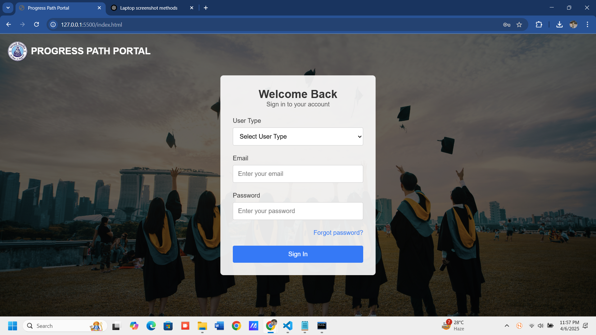
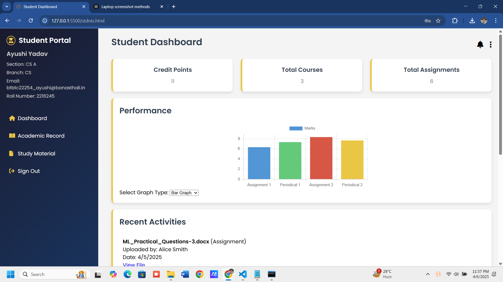
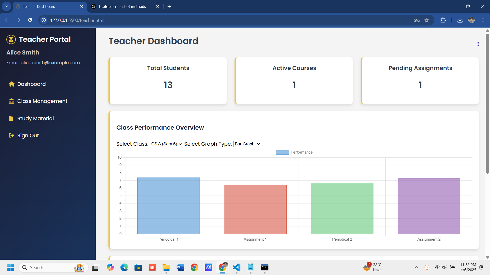
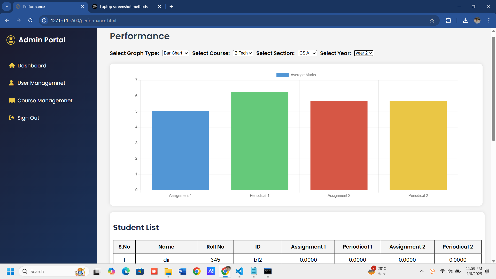

# 🧭 Progress Path – Academic Transparency, Made Simple
A Smart, Intuitive Student-Teacher Portal for managing marks, assignments, study materials, and academic communication in real-time.

## 📋 Table of Contents
- [Overview](#-overview)
- [Key Objectives](#-key-objectives)
- [Features](#-features)
- [Technologies Used](#-technologies-used)
- [API Endpoints](#-api-endpoints)
- [Project Structure](#-project-structure)
- [Installation & Setup](#-installation--setup)
- [Deployment & Maintenance](#-deployment--maintenance)
- [Usage](#-usage)
- [Screenshots & UI/UX](#-screenshots--uiux)
- [Security Highlights](#-security-highlights)
- [Future Enhancements](#-future-enhancements)
- [Contributors](#-contributors)

## 🔍 Overview

Progress Path is a modular web application designed to streamline academic workflows between students and teachers. Built with a responsive UI and secure backend, it empowers students to monitor their continuous assessment progress, while enabling teachers and administrators to update marks, assignments, and resources effortlessly.

## 🎯 Key Objectives

- To provide a simple and intuitive portal for academic management.
- To enhance real-time communication between students, teachers, and administration.
- To streamline the workflow for marks, assignments, and study material management.

## ✨ Features

### 🎓 Student Portal
- **View marks** (graphical & tabular view)
- **Upload assignments**
- **Download study material**
- **Access faculty contacts and syllabus**

### 👩‍🏫 Teacher Portal
- **Upload marks**
- **Share study material files and assignments**
- **Make announcements to class**
- **View uploaded assignments**

### 🧑‍💼 Admin Portal
- **Manage student and teacher accounts**
- **Assign courses and sections**
- **View dashboard statistics and performance data**
- **Control system configurations** (e.g., class schedules, course creation)

## 🛠️ Technologies Used

| Component       | Technology                            |
| --------------- | ------------------------------------- |
| Frontend        | HTML, CSS, JavaScript                 |
| Backend         | Node.js, Express.js                   |
| Database        | MySQL                                 |
| UI Library      | Bootstrap, Material-UI                |
| Auth            | JWT, Google OAuth 2.0                 |
| File Handling   | Local storage (potential Cloudinary or AWS S3) |
| Email           | Nodemailer (SMTP)                     |
| API Style       | RESTful (GET/POST)                    |
| Deployment      | Oracle Cloud VM                       |

## 📡 API Endpoints

### 🔐 Authentication

| Method | Endpoint            | Description                              |
| ------ | ------------------- | ---------------------------------------- |
| POST   | `/login`            | Log in user (student/teacher/admin)      |
| GET    | `/logout`           | Logout current session                   |
| POST   | `/forget-password`  | Send password to registered email        |

### 🎓 Student APIs

| Method | Endpoint                             | Description                                         |
| ------ | ------------------------------------ | --------------------------------------------------- |
| GET    | `/student`                          | Get student profile, credit points, performance graph |
| GET    | `/student/notifications`            | Get student notifications                           |
| POST   | `/student/change-password`          | Student password change                             |
| GET    | `/acad`                             | Student academic record (courses + marks)           |
| GET    | `/studentstudy`                     | Get recent and all study materials & assignments    |
| POST   | `/uploadStudentAssignment`          | Upload an assignment as a student                   |

### 👨‍🏫 Teacher APIs

| Method | Endpoint                                 | Description                                               |
| ------ | ---------------------------------------- | --------------------------------------------------------- |
| GET    | `/teacher`                               | Get teacher dashboard info                                |
| POST   | `/teacher/change-password`               | Teacher password change                                  |
| GET    | `/teacherstudy`                          | Get teacher’s uploaded study materials and assignments    |
| GET    | `/teacherclasses`                        | Get classes + student counts assigned to the teacher      |
| GET    | `/teacher-lecture/:id`                   | Detailed teacher lecture and class info                   |
| POST   | `/addClass`                              | Assign class to a teacher                                 |
| POST   | `/uploadTeacherSubject`                  | Bulk upload class assignments (via Excel)                 |
| DELETE | `/deletelectureclass`                    | Delete a teacher's assigned class                         |

### 📝 Marks & Assignment Evaluation

| Method | Endpoint                                                                 | Description                       |
| ------ | ------------------------------------------------------------------------ | --------------------------------- |
| GET    | `/students/:teacher_id/:subject_id/:section_name/:semester`             | Fetch student list with marks     |
| POST   | `/savemarks`                                                            | Save or update student marks      |
| GET    | `/studentSubmissions`                                                   | Get student assignment submissions|

### 📘 Study Material & Assignment Upload

| Method | Endpoint                  | Description                           |
| ------ | ------------------------- | ------------------------------------- |
| POST   | `/upload-study-material`  | Upload study material as teacher      |
| POST   | `/upload-assignment`      | Upload assignment as teacher          |

### 🧑‍💼 Admin Dashboard

| Method | Endpoint                 | Description                        |
| ------ | ------------------------ | ---------------------------------- |
| GET    | `/admindashboard`        | Get admin dashboard stats          |
| GET    | `/getDropdownData`       | Get course/year/section options    |
| GET    | `/getGraphData`          | Get graph data for selected class  |
| GET    | `/getStudents`           | Get student performance list       |

### 📚 Subject Management

| Method | Endpoint                          | Description                    |
| ------ | --------------------------------- | ------------------------------ |
| GET    | `/subjects`                       | Get all subjects               |
| POST   | `/addSubject`                     | Add new subject                |
| DELETE | `/deleteSubject/:subject_id`      | Delete a subject               |
| GET    | `/getSubjectTeachers`             | Get teachers teaching a subject|

### 👨‍🏫 Teacher Management

| Method | Endpoint                       | Description                          |
| ------ | ------------------------------ | ------------------------------------ |
| GET    | `/teachers`                    | Get all teachers                     |
| POST   | `/addTeacher`                  | Add new teacher                      |
| POST   | `/uploadTeachers`              | Bulk upload teachers via Excel       |
| DELETE | `/deleteTeacher/:id`           | Delete a teacher                     |

### 🏫 Course & Section Management

| Method | Endpoint                     | Description                                |
| ------ | ---------------------------- | ------------------------------------------ |
| GET    | `/courses`                   | Get distinct courses                       |
| POST   | `/addCourse`                 | Add a new course + section                 |
| DELETE | `/deleteCourse/:name`        | Delete a course                            |
| GET    | `/students`                  | Get students by course + year              |

## 📂 Project Structure

```
progress-path/
├── client/            # Frontend HTML, CSS, and images
│   ├── assets/        # Project images and static resources
│   ├── styles/        # All CSS/SCSS files
│   └── pages/         # HTML pages for student, teacher, admin
├── server/            # Backend logic
│   ├── server.js      # Main server file
│   └── Creds/         # Credentials (e.g. email configs)
├── node_modules/      # Installed dependencies
├── package.json       # Project metadata and dependencies
├── package-lock.json  # Dependency versions
├── .env               # Environment variables
├── README.md          # Project description (this file)
└── demo.mp4           # Original demo video file
```

## ⚙️ Installation & Setup

### 📦 Prerequisites
- Node.js (LTS)
- MySQL Server
- Git (optional)
- Postman (for API testing)

### 🗄️ Step 1: Set Up the MySQL Database
Open MySQL Workbench or the Command Line.
Run the following SQL command to create the database:
CREATE DATABASE student_portal;

```sql
CREATE DATABASE student_portal;
-- (Optional) Import schema if provided.
```

### 📝 Step 2: Create `.env` File
In the project root, create a `.env`:
```env
PORT=5000
DB_HOST=localhost
DB_USER=root
DB_PASSWORD=your_mysql_password
DB_NAME=student_portal
JWT_SECRET=yourSecretKey
EMAIL_USER=your_email@example.com
EMAIL_PASS=your_email_password
```

### 📥 Step 3: Install Backend Dependencies
```bash
cd server
npm install express mysql dotenv body-parser cors nodemailer multer
```

### ▶️ Step 4: Start the Backend Server
```bash
node server.js
# Server runs at http://localhost:5000/
```

### 🌐 Step 5: Open the Frontend
Open the HTML files in `client/pages/` directly in your browser.

## 🌐 Deployment & Maintenance

1. Transfer project folder to your Oracle VM.
2. Install dependencies (`npm install`).
3. Ensure MySQL server is running and database exists.
4. Verify `.env` credentials.
5. Start server: `node server.js`.

### 🔧 Maintenance Guidelines

| Task                        | Frequency        | Notes                                        |
| --------------------------- | ---------------- | -------------------------------------------- |
| Restart Node Server         | As needed        | Use `pm2 restart server` or manual restart. |
| Test API Endpoints          | After updates    | Use Postman for verification.               |
| Database Backup             | Daily/Weekly     | Via MySQL Workbench or custom script.       |
| Clear Uploaded Files        | Monthly          | Manual or automated cleanup.                |
| Update Dependencies         | Bi-monthly       | Run `npm outdated` and `npm update`.        |
| Log & Error Monitoring      | Continuous       | Integrate Winston or Sentry.                |

## 🧑‍💻 Usage

### For Students
- Register/Login
- View Marks, Attendance, Timetable & Faculty Info
- Download Study Materials and Upload Assignments

### For Teachers
- Login to Dashboard
- Upload Marks, Attendance, Study Materials
- Make Announcements to Class

### For Admins
- Manage Users, Courses & Sections
- View Analytics and System Stats

> **Note**: All actions update in real-time.  
> **Supported file uploads**: PDF, DOCX, PPT.

## 📸 Screenshots & UI/UX
<p align="center">
  
  <br>
  
  
</p>

## 🔒 Security Highlights
- Role-Based Access Control (Student/Teacher/Admin)
- HTTPS & Hashed Passwords
- Session Timeouts
- Automated Backups & Recovery

## 🧠 Future Enhancements
- Departmental Scalability
- AI-Powered Performance Insights
- Attendance Tracking
- Student-Parent Portal
- Dark Mode Support

## 👥 Contributors
- **Ruchi Shaktawat**  
- **Ayushi Yadav**  
- **Kritika Bhati**  

**Contact**:  
ruchishaktawat5@gmail.com | ayushipramodsingh@gmail.com | kritikabhati24@gmail.com
